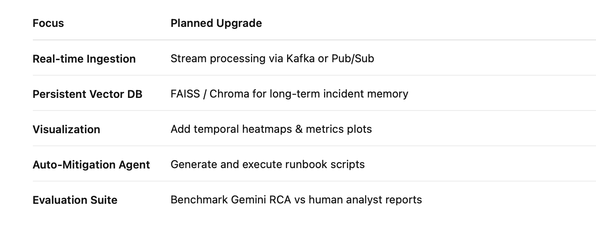
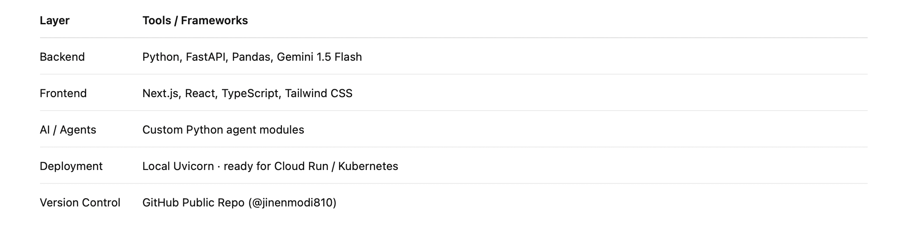

# **Enterprise Ops Agent**
### *AI-powered incident analysis, RCA intelligence, and proactive prevention system*  

---

## 🧭 Overview
**Enterprise Ops Agent** is a multi-agent, Gemini-powered platform that automates **Root-Cause Analysis (RCA)** for enterprise incidents.  
It ingests raw operational logs or alerts, constructs an ordered event timeline, generates causal hypotheses, evaluates confidence scores, and produces an end-to-end narrative with recommended preventive actions—all through autonomous agents.

Built with **FastAPI (backend)** and **Next.js (frontend)**, it demonstrates how LLM reasoning can augment traditional observability pipelines used by SRE and DevOps teams.

---

## 🚨 Problem Statement
Modern distributed systems emit millions of alerts across services, infrastructure, and customer touchpoints.  
During an outage, engineers must manually correlate logs, traces, and metrics across multiple tools (Datadog, CloudWatch, Splunk, PagerDuty).  
This process is slow, fragmented, and error-prone—driving up Mean Time to Resolution (MTTR) and operational costs.

**Key Challenges**
- Information overload and unstructured telemetry  
- Context split across tools and teams  
- Reactive, manual RCA workflows  

---

## 🤖 Solution Overview
**Enterprise Ops Agent** delivers a fully automated RCA pipeline using a **multi-agent architecture**.  

| Stage | Agent | Function |
|--------|--------|-----------|
| 1 | **Ingestion Agent** | Parses CSV/log streams into structured events |
| 2 | **Timeline Agent** | Organizes events into detection → mitigation → resolution phases |
| 3 | **Root Cause Agent (Gemini 1.5 Flash)** | Generates causal hypotheses and explanations |
| 4 | **Calibration Agent** | Normalizes and rescales confidence scores |
| 5 | **Similarity Agent** | Finds historical incidents with semantic similarity |
| 6 | **Narrative Agent** | Writes a human-readable post-incident report |
| 7 | **Recommendation Agent** | Suggests preventive and ownership actions |
| 8 | **Causal Graph Agent** | Builds dependency graph across contributing failures |

Outputs are visualized through the React dashboard with dedicated tabs for each analytical view (Timeline, Hypotheses, Narrative, Recommendations, Calibration, Causal Graph).

---

## 🏗️ Architecture

Frontend (Next.js / React)
│
▼
FastAPI  ──►  Ingestion Agent
│
├─► Timeline Agent
├─► Root Cause Agent (Gemini)
├─► Calibration Agent
├─► Similarity Agent
├─► Narrative Agent
├─► Recommendation Agent
└─► Causal Graph Agent
│
▼
JSON Response → Dashboard Visualization

>   
> *Figure 1 – Enterprise Ops Agent multi-agent workflow.*

**Backend Stack:** Python 3.11 · FastAPI · Pandas · Gemini 1.5 Flash  
**Frontend Stack:** Next.js · TypeScript · Tailwind CSS  
**Runtime:** Local FastAPI (`uvicorn main:app --reload`) + React dev server  

---

## ⚙️ Setup & Execution

### **1 · Clone Repository**
```bash
git clone https://github.com/jinenmodi810/EnterpriseOpsAgent.git
cd EnterpriseOpsAgent


2️⃣ Backend Setup (FastAPI + Gemini RCA Engine)

Create a virtual environment, install dependencies, and start the FastAPI server.

cd backend
python3 -m venv .venv
source .venv/bin/activate      # On Windows: .venv\Scripts\activate
pip install -r requirements.txt
uvicorn main:app --reload

After starting, the backend API will be available at:
👉 http://127.0.0.1:8000

You can test it quickly:

curl -X 'POST' \
  'http://127.0.0.1:8000/api/v1/analyze/' \
  -F 'file=@data/sample_incident.csv'


3️⃣ Frontend Setup (Next.js Dashboard)

Run the Next.js interface to visualize analysis results.

cd frontend
npm install
npm run dev

Access the dashboard at:
👉 http://localhost:3000


4️⃣ Workflow Summary
	1.	Go to http://localhost:3000/upload
	2.	Upload your CSV log file
	3.	Wait for the success banner → “Analysis complete”
	4.	Explore insights under these pages:
	•	/analysis – Overview
	•	/timeline – Event sequence
	•	/hypotheses – Root cause reasoning
	•	/narrative – LLM-generated RCA report
	•	/recommend – Preventive actions
	•	/causal – Dependency graph visualization

⸻

🧪 Usage Example
	1.	Upload a CSV log file via the “Upload Logs” page (e.g. incident_logs.csv).
	2.	System calls /api/v1/analyze/ → Gemini RCA engine returns JSON.
	3.	Dashboard shows a success banner → View Insights.
	4.	Explore results across analytical views.

Sample Output Highlights
	•	Primary Cause: payments-service timeout
	•	Confidence: 0.23
	•	Similar Incidents: INC_PAYMENTS_TIMEOUT (0.91)
	•	Recommendations: Post-incident review + update playbooks

⸻

🧩 Repository Structure

backend/
 ├── main.py
 ├── api/v1/analyze.py
 ├── agents/
 │   ├── ingestion_agent.py
 │   ├── root_cause_agent.py
 │   ├── calibration_agent.py
 │   ├── recommendation_agent.py
 │   └── ...
frontend/
 ├── src/app/(dashboard)/
 │   ├── analysis/page.tsx
 │   ├── timeline/page.tsx
 │   ├── hypotheses/page.tsx
 │   └── ...
 └── src/app/upload/page.tsx
data/
 └── sample_incident.csv

📊 Key Features
	•	Multi-agent RCA pipeline with Gemini LLM
	•	Confidence calibration & evidence scoring
	•	Historical similarity matching
	•	Human-readable incident narratives
	•	Full Next.js dashboard UI
	•	Modular Python architecture for extensibility

⸻

🌐 Integration Potential

The architecture can integrate with:
	•	Datadog / CloudWatch APIs for live log streams
	•	ServiceNow / PagerDuty for incident ticket sync
	•	Snowflake / BigQuery for historical incident storage

⸻

🚀 Future Enhancements



🧠 Learning Highlights
	•	Applied multi-agent orchestration for LLM reasoning
	•	Combined rule-based and probabilistic logic
	•	Built a full-stack AI Ops platform from scratch
	•	Implemented explainable AI reports for enterprise use


🛠️ Tech Stack



📈 Value Proposition

Enterprise Ops Agent reduces RCA time from hours to minutes, bridges data silos, and provides explainable insights for SRE teams.
Its architecture is modular, extensible, and aligned with modern AI Ops use cases across cloud enterprises.

⸻

📄 License

This repository is released under the Attribution 4.0 International (CC BY 4.0) license.

⸻

✍️ Citation

Jinen Modi. Enterprise Ops Agent. Kaggle Agents Intensive Capstone Project Submission, December 2025.
---

